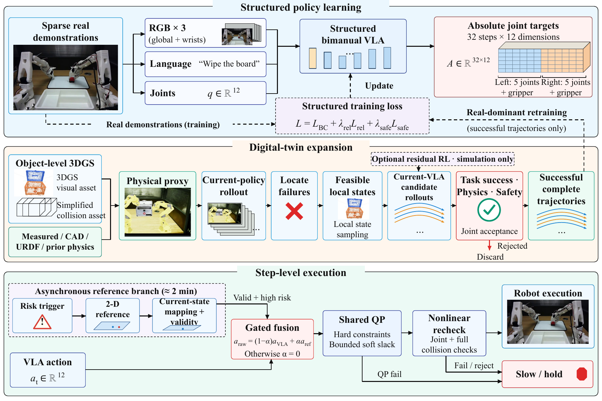

# More from Less

**3D Gaussian Splatting Digital Twins with Iterative Expansion and Trajectory Compensation for Sparse-Demonstration Bimanual Manipulation**

Anonymous Authors · Anonymous review version

[项目主页](https://robovla.github.io/More-from-Less/) · [可浏览代码目录](https://robovla.github.io/More-from-Less/code.html) · [代码与论文对应关系](docs/PAPER_PIPELINE.md) · [来源清单](docs/source_manifest.json) · [复现范围](docs/REPRODUCIBILITY.md)

本地验证记录：[docs/VALIDATION.md](docs/VALIDATION.md)。

本仓库整理论文的现有代码与配套材料。当前公开阅读稿为 **v164 匿名版**；实验内容沿用 v162，资源获取说明与本次代码发布同步，来源和文件哈希见 [当前稿件清单](docs/current_manuscript.json)。已有汇总实验数据保持原样。本次新增结构化训练、失败区域拓展与在线过滤的参考实现，以及附录曲线复现入口。新增实现不是恢复的历史实验代码；原始检查点和运行日志缺失，因此不能一键重现 Table 1–8。详细接口与验证范围见 [方法参考实现](docs/METHOD_REFERENCE.md)。

## 方法

1. **结构化双臂 VLA**：同步全局/左右腕部 RGB、语言和关节状态作为前向输入，联合输出 32 步 × 12 维绝对关节目标；位姿和距离关系提供训练期几何监督，接触与角色标签只提供固定训练上下文。
2. **对象级代理与失败区域拓展**：3DGS 外观、简化碰撞资产及测量/CAD/URDF/先验物理分开建模；只有通过任务、物理和安全验收的成功完整虚拟轨迹回流训练。
3. **步骤级恢复**：异步生成二维图像参考，经当前状态对齐、深度/标定、任务掩码 IK、有效性门控及共享 QP/非线性复检后执行。夹爪继承 VLA。视频生成约两分钟，不属于高频控制周期。



## 目录与可运行范围

| 路径 | 内容 | 当前状态 |
|---|---|---|
| `morefromless/method/` | 可微关系监督/FK、训练入口、迭代验收引擎、异步参考/DLS/共享QP控制 | 新增参考实现；需要实际主干、几何、仿真和设备适配器 |
| `morefromless/trajectory/` | 位姿读写、通用融合、附录历史处理过程重算 | 附录72/75点逐分量验证；仅离线诊断 |
| `examples/trajectories/{pour,wipe}/` | 已有生成/重定向/融合轨迹 | 保留原始示例，不是新增实机数据 |
| `reference_code/gaussian_grouping/` | 已有对象级重建训练、渲染及支持模块快照 | 需上游 CUDA/数据环境；不是 VLA 训练代码 |
| `reference_code/3dgs_proxy/` | PLY 裁剪、分割、碰撞网格、USD/铰链组装 | 需 Open3D / 3DGRUT / USD 等外部环境 |
| `reference_code/leisaac/` | 已有推理、动作接口、示教格式转换及铰链交互入口 | 需完整 leisaac / Isaac Sim 环境 |
| `tools/gemini_camera/` | 已有 RGB-D 相机采集与调参工具 | 需硬件、驱动和 SDK |
| `tools/trajectory_compensation/` | 已有视频与轨迹处理脚本 | 历史离线工具，含场景默认路径 |
| `paper_pipeline/` | 默认执行附录复现；可选运行方法参考实现检查 | 工程检查与历史实验复现分别标注 |
| `static/media/v162/` | 当前 v162 论文插图 | 图 1–4 为对应矢量 PDF 及预览，其他图与 LaTeX 资源一致 |
| `index.html`, `code.html`, `static/` | 静态学术项目主页 | 可本地预览；适配 GitHub Pages 子路径 |

## 快速开始

Python 3.10 或以上；运行下面命令前进入本仓库根目录。

```bash
python -m venv .venv
# Windows PowerShell
.venv\Scripts\Activate.ps1
# Linux/macOS: source .venv/bin/activate
python -m pip install -r requirements.txt
python -m unittest discover -s tests -v
python paper_pipeline/run_morefromless_pipeline.py --dry-run --include-disabled
python paper_pipeline/run_morefromless_pipeline.py
```

最后一条命令按历史时变权重和平滑过程重算附录曲线，输出到 `outputs/appendix_reproduction/{pour,wipe}/`，逐分量核对保存的 F；不覆盖示例。也可直接运行 `python -m morefromless.trajectory.reproduce_appendix`。可选安装包：`python -m pip install -e .`。

安装 `requirements-method.txt` 后可验证 PyTorch 梯度和结构化训练入口。可选阶段 `--stage structured_vla / failure_expansion / online_compensation` 运行参考模块工程检查；实际训练接入方式见 [METHOD_REFERENCE.md](docs/METHOD_REFERENCE.md)，这些检查不产生论文实验结果。

通用固定权重融合示例（与附录历史处理过程不同）：

```bash
python -m morefromless.trajectory.fuse_trajectories --generated examples/trajectories/pour/generated_pose_xyzrpy.csv --real-retargeted examples/trajectories/pour/real_retargeted_pose_xyzrpy.csv --out-dir outputs/pour_demo --real-weight 0.55
```

输入列：`frame,time_s,x,y,z,rx,ry,rz`。当前示例位置为毫米、角度为度，坐标系为相机 `+X右、+Y下、+Z前`。两条轨迹必须使用同一时间原点、坐标系和单位。实现采用分量线性插值/融合，参考时间范围之外沿用端点，不是 SE(3) 姿态融合；不能直接作为机器人 12 维关节命令。示例权重 0.55 是离线演示参数，不是论文在线门控权重。

## 本地主页

```bash
python scripts/serve.py
```

打开 **http://127.0.0.1:18765/**。地址仅在本机服务运行时有效。也可直接用浏览器打开 `index.html`；内置代码查看器需 HTTP 服务。此脚本只监听本机，隐藏 `.git` 和目录列表，不执行部署。服务独占所选端口；若端口已占用，使用 `--port` 另选空闲端口，不终止其他项目的服务。

主页采用 CVPR 常见论文项目页风格：完整题名居中、深色资源按钮、宽幅双视频，以及 Abstract—Method Overview—Experiments—Code & Resources—BibTeX 的阅读顺序。三部分方法图连续展示，表 1、2、4、6 可切换，手机端视频自动改为单列。版式参考 Nerfies / Academic Project Page Template，使用本地 CSS/JS，不依赖 CDN；这只是版式说明，不表示会议录用。模板来源与许可说明见 [THIRD_PARTY_NOTICES.md](THIRD_PARTY_NOTICES.md)。当前主页使用 `static/media/v162/` 中未改动的论文插图和 `paper/anonymous_review.pdf`。旧图与 v155 快照已归档到公开仓库之外；公开文件清单只保留当前稿件资源。

## 依赖与复现边界

可运行轨迹模块只需要 NumPy。视频诊断的额外依赖见 `requirements-vision.txt`；几何工具见 `requirements-geometry.txt`。训练/仿真需单独按 [reference_code/README.md](reference_code/README.md) 配置上游环境，不能由普通 `pip install` 自动得到原始实验系统。

参考实现已覆盖结构化训练目标、失败区域迭代验收和在线视频参考—IK—共享QP的控制逻辑；真实模型、场景、跟踪和硬件仍需通过显式接口接入。原实验检查点、训练配置与逐回合日志未恢复，工程测试不能替代原实验验证。数据划分、硬件及动作接口边界见 [复现说明](docs/REPRODUCIBILITY.md)。

## GitHub 仓库与主页

代码仓库：[RoboVLA/More-from-Less](https://github.com/RoboVLA/More-from-Less)。正式主页：[robovla.github.io/More-from-Less](https://robovla.github.io/More-from-Less/)。GitHub Pages 从 `main` 分支根目录发布，站内链接使用相对路径；本地主页预览仍可独立使用。说明见 [docs/LOCAL_RELEASE.md](docs/LOCAL_RELEASE.md)。

## 引用与许可

当前为未正式发表稿件，请使用 [CITATION.cff](CITATION.cff)，不要把目标期刊写成已接收刊物。

本仓库自有代码采用 MIT；第三方来源快照保留各自许可证与文件头，论文、图像、视频和实验数据不自动适用代码许可证，详见 [LICENSE](LICENSE) 和 [THIRD_PARTY_NOTICES.md](THIRD_PARTY_NOTICES.md)。
